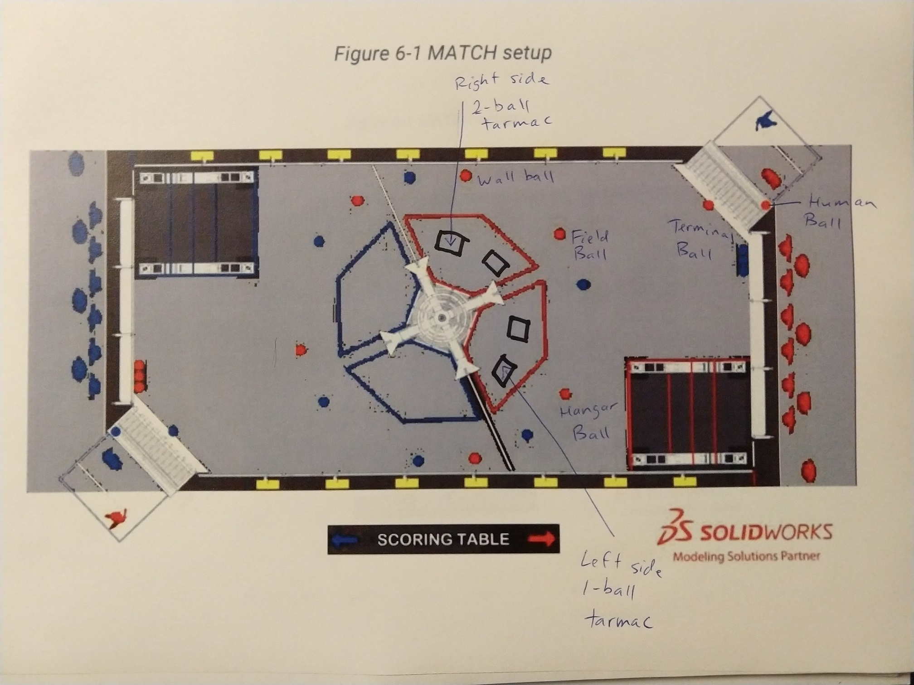
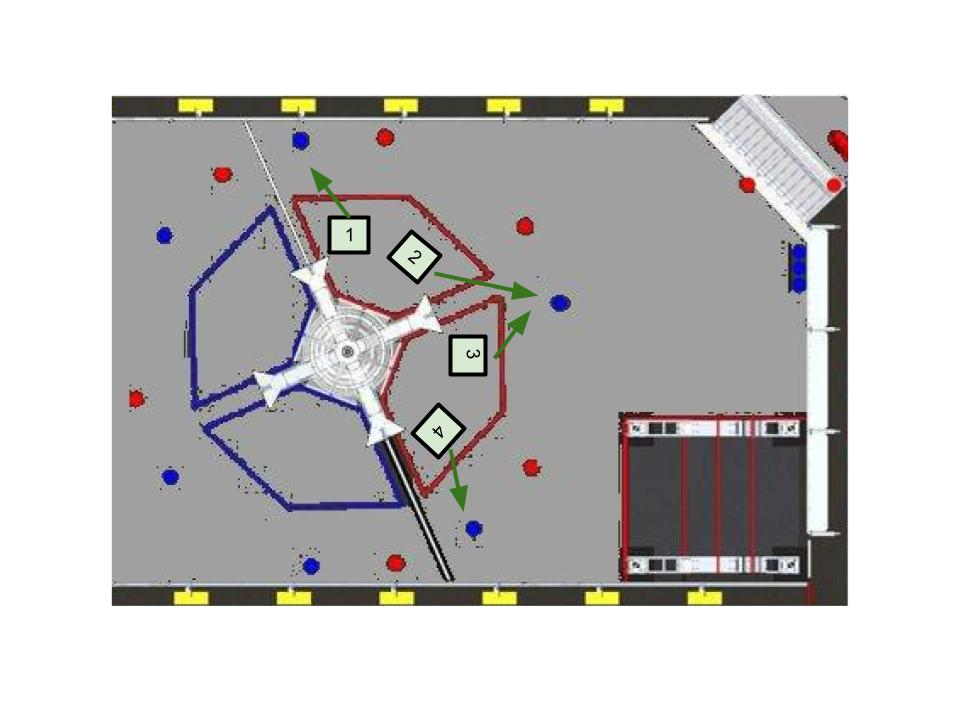

Our goal for autos is to shoot four balls into the high goal during the first 15 seconds of the match. On the way to creating a successful 4-ball auto we will create a zero-ball, 1-ball, 2-ball and 3-ball autos.

We assume our robot will use swerve drive, which allows the robot to remain facing the hub as it moves to pick up each ball. A successful four-ball auto will require the following:

- ability to shoot balls into the high goal
- ability to move to and pick up stationary balls on our side of the arena
- take ten seconds or less to move to our alliance's wall ball, field ball and terminal ball positions
- take one second or less to pick up a stationary ball from the ground
- be able to shoot accurately from different places on the field while moving

Assuming we are red alliance:

- The top tarmac in the match setup diagram we call the "two-ball" tarmac because there are two red balls near it.
- The ball near the wall is the "wall ball."
- The ball in the middle of the field is the "field ball."
- The ball near the hangar is the "hangar ball."
- The ball near the terminal is the "terminal ball."
- The ball the human is holding at the beginning of the game is the "human ball."
- The lower tarmac is the "one-ball" tarmac.

There are four possible starting positions for the robot:

1. right side of 2-ball tarmac is on the right side of the two-ball tarmac as you're looking toward the hub,
2. left side of 2-ball tarmac,
3. right side of 1-ball tarmac,
4. left side of 1-ball tarmac.

# Zero-Ball Auto

In zero-ball auto we do not shoot any balls. The most likely reason we would run a zero-ball auto is that our shooter is broken. There are two main objectives for zero-ball auto:

1. Score two points by moving our robot completely out of the tarmac.
2. Stay out of the way of our alliance partners so they can score more points.

For all starting positions we will line up the robot so the shooter is facing the hub, using the tarmac edge as a guideline. Starting positions:

1. *Right side of the two-ball tarmac.* Give robot in position two a clear path to our wall ball. Pin the opposition's wall ball against the wall.
2. *Left side of the two-ball tarmac.* Give robot in position one a clear path to our field ball. Bump the opposition's field ball toward our hangar.
3. **Right side of the one-ball tarmac, our preferred starting position for a zero-ball auto.** Give robot in position four a clear path to our hangar ball. Bump the opposition's field ball toward our hangar, taking care not to bump it into our field ball or toward our terminal ball.
4. *Left side of the one-ball tarmac.* Give robot in position three a clear path to our hangar ball. Pin the opposition's hangar ball against the wall.

# One-Ball Auto

In one-ball auto we shoot the ball we start with, but we do not pick up any additional balls. The most likely reason we would run a one-ball auto is that our intake is broken.

- *Shoot and move.* Everything is the same as zero-ball auto, except that we shoot our ball before taxiing out of the tarmac.
- *Shoot and stay.* We shoot our ball and stay in place. The most likely reason to run "One-Ball Auto Shoot and Stay" is that our drive train is broken.

# Two-Ball Auto

In two-ball auto we shoot the ball we start with, move to pick up a ball, and shoot that ball. The most likely reason we would run a two-ball auto is that an alliance partner has a better three-ball or four-ball auto than ours. There are five objectives for two-ball auto:

1. Score four points by shooting a ball into the high goal.
2. Score two points by moving our robot completely out of the tarmac.
3. Pick up a ball.
4. Shoot that ball into the high goal.
5. Stay out of the way of our alliance partners so they can score more points.

# Three-Ball Auto

In three-ball auto, we have six objectives:

1. Score four points by shooting a ball into the high goal.
2. Score two points by moving our robot completely out of the tarmac.
3. Pick up a ball.
4. Shoot that ball into the high goal.
5. Pick up another ball.
6. Shoot that ball into the high goal.

# Four-Ball Auto

In four-ball auto, we start in position one (right side of two-ball tarmac) and have eight objectives:

1. Score four points by shooting a ball into the high goal.
2. Score two points by moving our robot completely out of the tarmac.
3. Pick up our wall ball.
4. Shoot that ball into the high goal.
5. Pick up our field ball.
6. Shoot that ball into the high goal.
7. Pick up our terminal ball.
8. Shoot that ball into the high goal.

# Five-Ball Auto

In five-ball auto, we have to count on our human player to score or add abilities to our robot.

To score the ball the human holds during auto:

1. Human player could throw ball directly into hub.
2. Human player could roll ball into robot. This requires a ramp intake on the robot.
3. Human player could roll ball onto playing field. This requires robot to either position itself so human player can aim for ground-ball intake, or robot to have vision, ball detection, and "move to intake moving ball" capabilities.

To score stationary ground balls on the other side of the arena during auto:

- Robot requires vision, robot detection, and "move to avoid other robots" capabilities.

To score balls after they have been shot on goal:

- Robot needs vision, ball detection, and "move to intake moving ball" capabilities.

# Notes
2 ball tarmac - 4 ball auto - shoot 2 balls get wall ball field ball termial ball shoot all
2 ball tarmac - 3 ball auto shoot 
1 ball shoot and move
2 ball bind auto - shoot all - get wall ball get field ball
2 ball vison auto - shoot all - get wall ball get field ball (can start anywhere and pick up balls a shoot)
3 ball either get wall ball or get field ball

no reason to collect ball from terminal - Dennis 
ground intake no termnial intake
no five ball auto max is a five a ball auto human player shoots last ball

move out of tarmac and back into bad rule??
better the shoot anywhere or one stop??